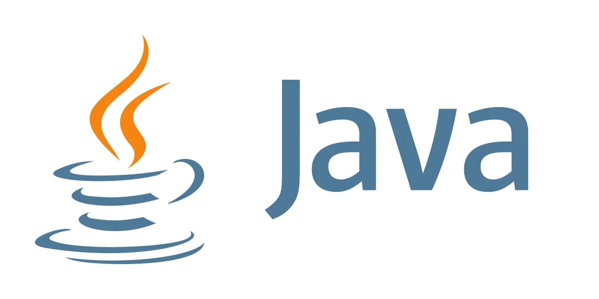

# Selection

My second programming assignment involving the concept of selection. The criteria is outlined below:

## Problem 1 Scenario: Letter Grade Conversions

When giving the final grades to students, the earned marks are converted into a letter grade. This conversion is shown in the course outline for this course. Your task is to create a program that will take in the student name, his earned marks and convert the marks into a letter grade. The results should be printed out as an output as described below. You should also have a closing message to provide the user with information that the processing is over.

For the purposes of this assignment, we will simplify the conversion. Rather than converting into 12 categories (that include the letter grade and “ + ” and “ – “ add-ons to the letter grade)  we will simply use 5 categories (A, B, C, D, F). Thus, A-, A, A+ will be categorized into the letter grade A. Note that the boundary value for A will be that of the A- range in the outline. 

In addition, you will note that the earned marks cannot be negative or greater than 100. You should perform error checking on the earned marks. If the inputted value is outside the range, an appropriate message should be printed.

## Problem 2 Scenario: Interest on Accounts

Banks often pay different interest rates depending on the type of accounts that a customer holds. For this problem, we will look at calculating the interest amount. Assume that there are 4 types of interest bearing accounts: chequing (‘C’), Savings (‘S’), GIC (‘G’) and TFSA (‘T’). Your task is to create a program that will calculate and print the amount of interest earned by a given account. It is possible that the user could enter an invalid type.

For this problem, you are required to use the _Switch_ statement in Java.

## Problem 3 Scenario: Concert Tickets

Entertainment Ltd. sponsors concerts and sells tickets to the general public. They have leased a concert hall and all their concerts are held in that hall. The hall has three seating sections: the lower level (‘L’), the middle level (‘M’), and the upper level (‘U’). The price of a ticket is dependent on who is performing at the concert.  

Your task would be to create a program that will print out the cost of the tickets based on the inputs and the conditions that are described below. For this part, no error checking is required although you a free to include it in your solution.
